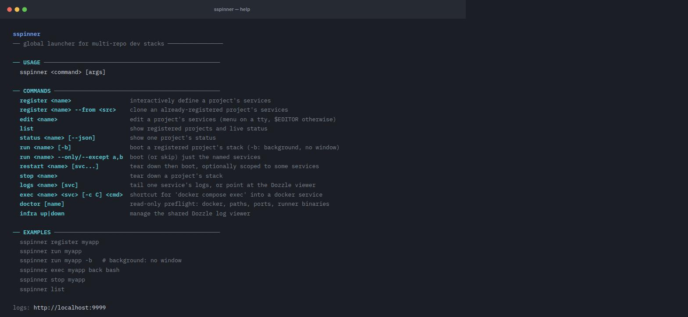
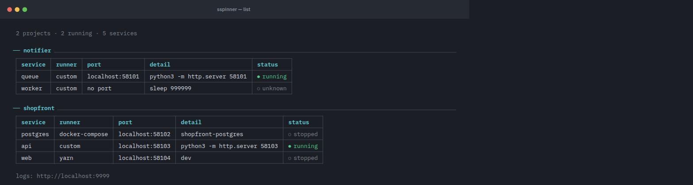

# SSpinner

Global launcher for multi-repo local dev stacks. You register a project once
— its services, where they live, and how each one is run (`docker compose`,
`yarn`, `pnpm`, `poetry`, or any custom command) — and from then on boot the
whole thing from anywhere with one command:

```bash
sspinner run myapp
```

Each service gets its own window with its actual live output (docker compose
logs, Vite/webpack output, whatever it prints), started in the order you
registered them, each one waited on before the next starts if you gave it a
port. Windows open in [Terminator](https://gnome-terminator.org/) if it's
installed (a real split-pane grid in one window), falling back to your
default terminal emulator (one window per service), falling back to a plain
sequential mode with no windows at all. A shared Dozzle container gives a
web-based view of every project's docker logs regardless of which one is
currently running.

<p align="center"></p>

## Install

```bash
git clone git@github.com:Carlstain/sspinner.git ~/tools/sspinner
~/tools/sspinner/install.sh
```

This symlinks `sspinner` onto `~/.local/bin`, wires up shell completion (see
below), and checks for `docker` (required) and a terminal backend (optional —
`terminator` is recommended for the nicest split-pane grid; otherwise `run`
opens one window per service in whatever terminal emulator your desktop
already defaults to; it falls back to a sequential, no-window mode only if
neither is found).

## Shell completion

`install.sh` adds a sourcing line to `~/.bashrc` and/or `~/.zshrc` (whichever
exist) — open a new shell afterward and `sspinner <TAB>` completes
subcommands, `sspinner run <TAB>` completes registered project names (pulled
live from the registry), and `sspinner infra <TAB>` completes `up`/`down`.
The scripts live in `completions/` if you want to source them manually
instead.

## Commands

```bash
sspinner register <project>   # interactive: add services one at a time
sspinner edit <project>       # open the raw config in $EDITOR
sspinner list                 # show every registered project + live up/down status
sspinner run <project>        # boot it: one window per service, in order
sspinner run <project> -b     # boot it in the background: no window at all
sspinner exec <project> <svc> [-c CONTAINER] <cmd>   # shortcut for docker compose exec
sspinner stop <project>       # tear everything down and verify it's actually gone
sspinner infra up / down      # manage the shared Dozzle log viewer directly
```

(`sspinner down <project>` still works as a deprecated alias for `stop`.)

`sspinner list` shows every registered project with a live status table —
green `● running` when a service's port answers (or its docker-compose
project has containers up), dim `○ stopped`/`○ unknown` otherwise:

<p align="center"></p>

### `run -b` boots without taking over your terminal

`-b`/`--background` always runs every service sequentially in the background
with output logged to temp files under the system temp dir, whether or not
Terminator or a terminal emulator is available — both windowed backends open
a GUI window, which is exactly what `-b` exists to avoid. Control returns to
your shell immediately once every service has started (or timed out waiting
on its port). Each service's process is tracked by a pid file under
`~/.config/sspinner/running/<project>/`, so `sspinner stop` can find and kill
it later even without a window or session to tear down.

### `exec` — a shortcut into a running container

`sspinner exec <project> <service> <command>...` is a shortcut for
`docker compose exec` that saves `cd`-ing to the repo and remembering the
pinned `-p` project name — it only works on `docker-compose` services. It
defaults to the container whose compose-service name matches the sspinner
service name; pass `-c/--container <name>` to reach a different one in the
same compose project (e.g. its database):

```bash
sspinner exec myapp back bash                          # shell in the 'back' container
sspinner exec myapp back -c database psql -U postgres  # a sibling container instead
```

If the target isn't running yet, it offers to `run` the project first.
Tab-completion for this command only proposes the project's docker-compose
services (and, after `-c`, that service's own containers) — not every
registered service.

### `register` walks you through each service

For every service it asks:
- **name** (e.g. `back`, `front`, `keycloak`)
- **path** — a live, filterable dropdown of matching directories as you type
  (arrow keys to move, Tab to descend, Enter to accept), falling back to a
  plain prompt if your terminal can't do that
- **how it's run** — `docker-compose`, `yarn`, `pnpm`, `npm`, `poetry`, or
  `custom`. If the path has a `docker-compose.yml`/`package.json`/
  `pyproject.toml`, that runner is floated to the top of the list; for Node
  projects, `package.json`'s `scripts` are offered as a pick-list instead of
  free text. Best-effort port detection pre-fills the port question too.
- **port** to wait on before starting the next service (optional — leave blank
  for a service with nothing to poll, e.g. a background worker)

The follow-up questions after picking a runner (compose project name, script
to run, the shell command for `custom`, ...) all accept Esc to back out and
re-pick the runner, so a wrong choice — or `custom`'s required command
prompt — never traps you.

Register in the order services should start — if you add more than one,
you're offered a chance to reorder them (boot order matters) before saving.
Run it again on an already-registered project to add more services, or start
over from scratch.

### Editing later

`sspinner edit <project>` opens just that project's config (not the whole
registry) as JSON in `$EDITOR` and validates it on save. You can also edit
`~/.config/sspinner/registry.json` directly — it's plain JSON, one entry per
project.

## What `run` actually does

0. If another registered project already has something running (checked by
   port and, for docker-compose services, by whether its compose project has
   containers up), it shows a table of what's running and asks what to do:
   stop the other one first, keep it running and start this one too, or
   cancel. Skipped entirely if nothing else is running, and auto-continues
   (leaving the other one running) when stdin isn't a terminal.
1. Makes sure the shared Dozzle container is running
   (`infra/docker-compose.yml`, published at http://localhost:9999 — shows
   live logs for every container on the machine, grouped by compose project).
2. Creates the project's shared docker network if it declared one.
3. Prints one status table — service / runner / detail / url / status — and
   keeps updating it in place as the boot progresses, rather than a wall of
   separate tables and headings. Each service's status cell moves through
   `○ queued` → a spinning `starting (Ns)` → `● running` (its port answered),
   `● started` (no port to check), or `✗ timeout` (its port never answered —
   `run` moves on to the next service regardless). A dim line under the
   table tracks which service is currently starting, and turns into the
   `terminator window: ...` / `terminal windows: ...` pointer once
   everything's up. If stdout isn't a terminal (piped/scripted), there's no
   animation: the table prints once up front, plain `✓ x is up on :port`
   lines print as each service finishes, then the table prints once more at
   the end.
4. Opens one window per service in registration order — a Terminator grid
   (at most 2 terminals per row) if it's installed, else one window per
   service in your default terminal emulator, else sequentially in the
   background with output logged to files under the system temp dir (the
   last service, if not `docker-compose`, then runs directly in your
   terminal). Every window/process is tracked by a pid file so `stop` can
   find and kill it later, regardless of which backend started it:
   - `docker-compose` services: `up -d --build` then `logs -f` in the same window
   - everything else: the service's actual run command, directly, in the foreground
   - if the service has a port, `run` polls it before moving on to the next one

## Where things live

- **Code** (this repo): `~/tools/sspinner` (or wherever you clone it).
- **Runtime state** (not in git): `~/.config/sspinner/registry.json` — the
  project → services config that every command reads/writes — and
  `~/.config/sspinner/running/<project>/` — one pid file per running
  non-terminator-tracked service, so `stop` can find and kill it later.

See `CLAUDE.md` for the internals if you're editing this tool with Claude Code.
